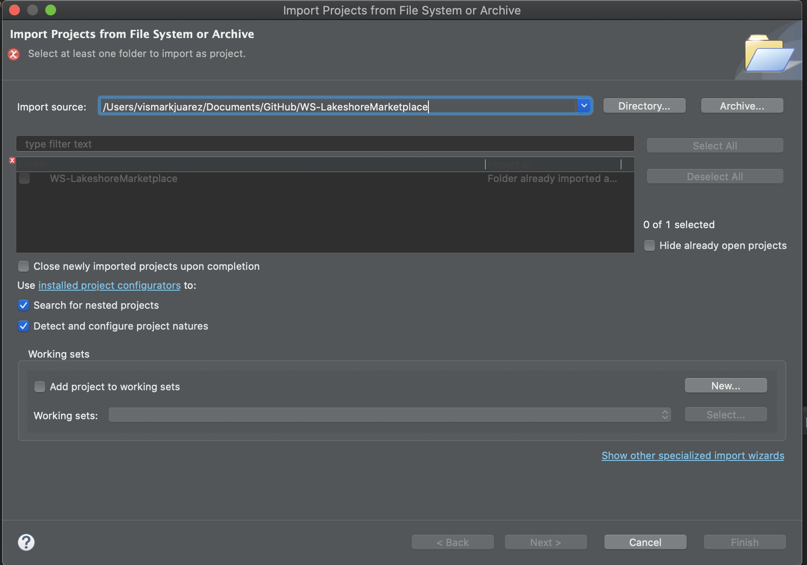
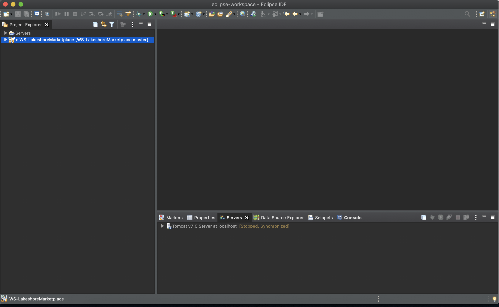
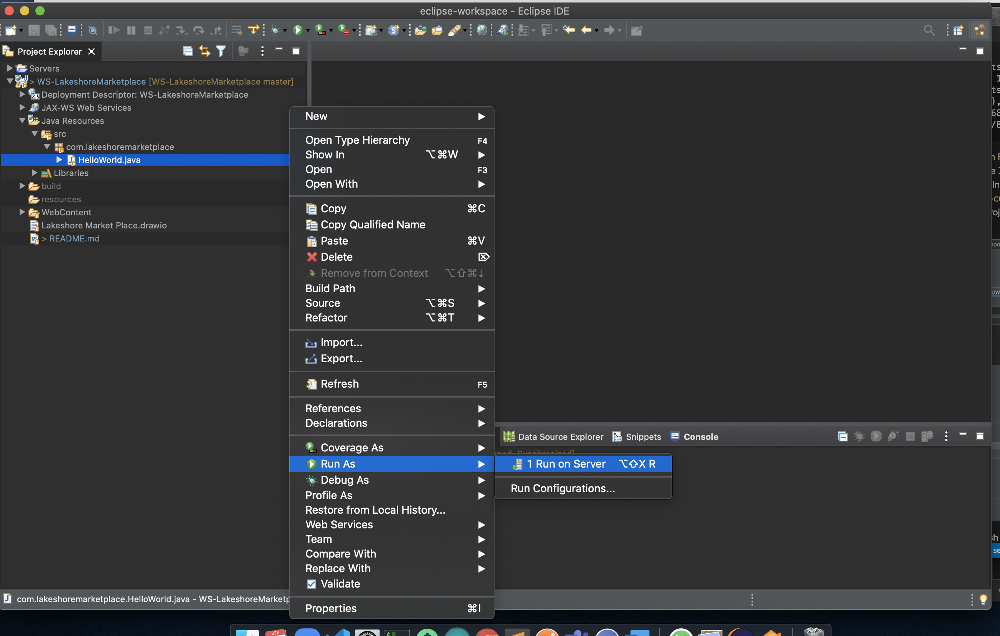
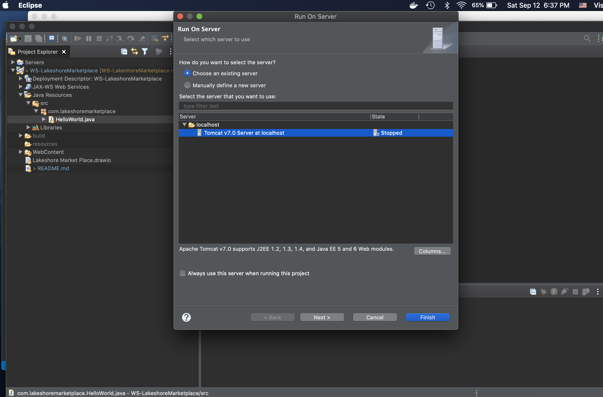
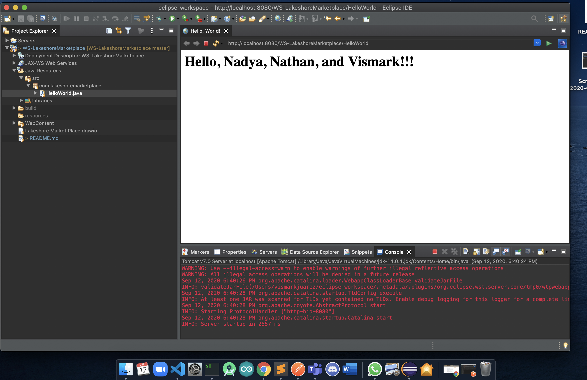

1. In your terminal window, navigate to a directory where you would like to clone the GitHub project.  In this
example, the directory `/Documents/GitHub` will be used as the root directory for cloning the `WS-LakeshoreMarketplace` project.

```bash
vismarkjuarez@MacBook-Pro~$ cd Documents/GitHub
vismarkjuarez@MacBook-Pro~/Documents/GitHub$
```

2. Now, clone the project repository by running the following git command:

```bash
vismarkjuarez@MacBook-Pro~/Documents/GitHub$ git clone https://github.com/VismarkJuarez/WS-LakeshoreMarketplace.git
Cloning into 'LakeshoreMarketplace'...
remote: Enumerating objects: 68, done.
remote: Counting objects: 100% (68/68), done.
remote: Compressing objects: 100% (43/43), done.
remote: Total 68 (delta 8), reused 60 (delta 7), pack-reused 0
Receiving objects: 100% (68/68), 13.14 KiB | 3.28 MiB/s, done.
Resolving deltas: 100% (8/8), done.
```

3. Now, open Eclipse and click on `File -> 'Open Projects from File System'` .  You will be prompted to specify the `Import source`, which is simply full path on your computer where your project is located.  In this example, we cloned the `WS-LakeshoreMarketplace` project into the computer's `Documents/GitHub` directory.  Click on the `Directory` button, navigate and and select the project folder (`Documents/GitHub/WS-LakeshoreMarketplace`).



Click the blue `Finish` button to finish importing the project into Eclipse.  You should now see the project folder in your Eclipse workspace:





4. Now, you're ready to run the project.  Simply expad the project folder and navigate to `'Java Resources'/src/com.lakeshoremarketplace`. Here, you will see a Java class named `HelloWorld.java`.


5. Right click on the `HelloWorld.java` file, and select `Run As -> Run on Server`


A new pop-up box should appear. If you configured Apache Tomcat already, you should see Tomcat listed in your list of servers as shown below:



Select the name of your server, and click on the blue `Finish` button.  Your server will automatically start up, and the project will run.


6. Eclipse will automatically open a new tab showing the web application's output:



This logic is written in the `HelloWorld.java` you right-clicked on to run the project